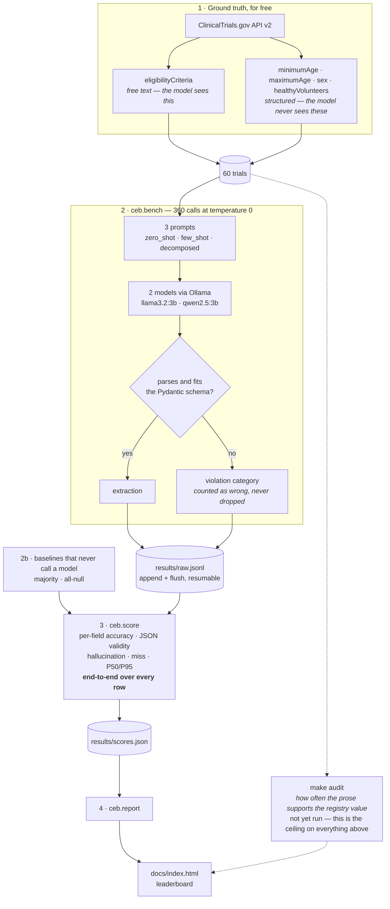
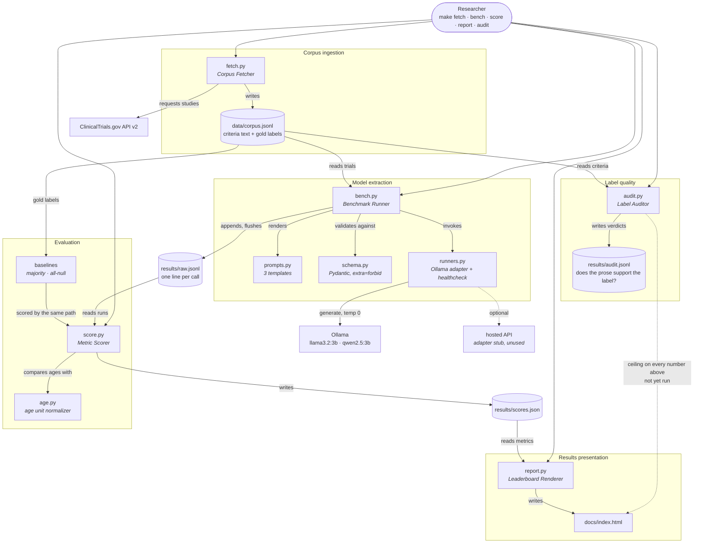

# clinical-extraction-bench

Can a small model running on a laptop recover structured eligibility
constraints from free-text clinical trial criteria &mdash; and how often does it
invent an answer the text never gave?

**[Leaderboard](https://divyadhole.github.io/clinical-extraction-bench/)**

---

## Results

360 calls: 60 trials x 3 prompts x 2 models, `temperature=0`, on a 16&nbsp;GB
M3 laptop. Full table on the [leaderboard](https://divyadhole.github.io/clinical-extraction-bench/);
`results/scores.json` has every number including the intervals.

| Model | Prompt | End-to-end acc | JSON valid | P50 s |
|---|---|---|---|---|
| **`baseline:majority`** | constant | **0.671** | 1.000 | 0.0 |
| llama3.2:3b | decomposed | 0.433 | 0.933 | 6.4 |
| qwen2.5:3b | zero_shot | 0.421 | 0.917 | 6.6 |
| qwen2.5:3b | few_shot | 0.383 | 1.000 | 6.9 |
| qwen2.5:3b | decomposed | 0.350 | 1.000 | 6.6 |
| llama3.2:3b | few_shot | 0.175 | 0.533 | 7.2 |
| llama3.2:3b | zero_shot | 0.142 | 0.333 | 9.6 |
| `baseline:all-null` | constant | 0.129 | 1.000 | 0.0 |

**Nothing here beats a constant.** Answering `18 / no maximum / ALL / does not
accept healthy volunteers` for every trial, without reading a word of the
criteria, recovers 67.1% of fields. The best model/prompt pair recovers 43.3%.
That is the result. The rest of this section is why.

### The aggregate hides two opposite failures

Per-field accuracy over all 60 trials, unparsed rows counted as wrong:

| | min age | max age | sex | healthy vol. |
|---|---|---|---|---|
| `baseline:majority` | 0.60 | 0.45 | **0.92** | **0.72** |
| llama3.2 decomposed | 0.48 | 0.43 | 0.22 | 0.60 |
| qwen2.5 zero_shot | **0.70** | **0.62** | 0.13 | 0.23 |
| qwen2.5 decomposed | 0.58 | 0.55 | 0.23 | 0.03 |

The two numeric fields and the two categorical fields are different tasks.

On **ages**, extraction works and beats the constant: qwen2.5 zero_shot reads a
minimum age correctly 70% of the time against the constant's 60%, and a maximum
age 62% against 45%. Small models can find a number in a sentence.

On **sex** and **healthy volunteers**, every configuration is far below the
constant, and the two models fail in opposite directions:

- **qwen2.5 abstains.** It returns `null` for `sex` on 46 of 60 trials and for
  `accepts_healthy_volunteers` on 58 of 60. Neither field is ever null in the
  gold data, so every abstention is a miss. Its scores here are caution, not
  error &mdash; it hallucinates on only 6.5% of genuinely unstated values.
- **llama3.2 commits, confidently and wrongly.** Under `decomposed` it answers
  `FEMALE` on 45 of the 56 trials it parsed. The true answer is `ALL` on 55 of
  60. It is not reading the criteria; it is pattern-matching to something in
  the prompt &mdash; see below, because this behaviour belongs to one prompt and
  not to the model.

Which makes first place worse than it looks. llama3.2/decomposed's 0.60 on
healthy volunteers comes from answering `False` on 49 of 56 trials &mdash; and
`False` is the majority class, present in 43 of 60. It scores 0.60 by guessing
a constant, badly; the constant itself scores 0.72. The top of this leaderboard
is a model that happens to guess in the right direction on one field. Without a
baseline row on the same table, that reads as an achievement.

### Two accuracy denominators, and why the obvious one lies

The first version of the scorer reported accuracy over the rows that produced
valid JSON. Under that denominator llama3.2/zero_shot scores 0.425 and ranks
third. It also parses 33% of the time. Counting the rows it failed to answer:
**0.142**, dead last. A model is rewarded for going silent on the documents it
finds hard, and the metric that rewards it is the one everyone reports.

Both are in `results/scores.json`. `end_to_end_accuracy` &mdash; all rows,
unparsed counted as wrong &mdash; is what sorts the table. Its confidence
interval is clustered by trial rather than by field, because four fields out of
one model call fail together; treating them as 240 independent draws would
claim about twice the precision the data supports.

### The prompt changes the failure mode more than the model does

Same model, same weights, `temperature=0`, three prompts, and three unrelated
behaviours on the `sex` field:

| llama3.2:3b | parsed | `ALL` | `FEMALE` | `null` |
|---|---|---|---|---|
| zero_shot | 20/60 | 14 | 1 | 4 |
| few_shot | 32/60 | 8 | 0 | 24 |
| decomposed | 56/60 | 11 | **45** | 0 |

Under `zero_shot` it mostly answers `ALL`, which is mostly right &mdash; on the
third of rows it manages to parse. Under `few_shot` it abstains. Under
`decomposed` it develops the `FEMALE` fixation that costs it the field. The
pathology that defines the top-scoring configuration does not exist in the
other two, so it is a property of the prompt, not of llama3.2.

This is the case for running three prompts rather than one. A single-prompt
benchmark would have reported one of these three and attributed it to the
model.

Neither model's best prompt is the same: `decomposed` for llama3.2,
`zero_shot` for qwen2.5. `few_shot` places second of three for both &mdash;
never the worst, never the best, and not worth its extra tokens here.

### Honest limits on these numbers

- **n=60.** The four pairs between 0.350 and 0.433 have overlapping intervals
  and are not distinguishable. Only the gap to the baseline and to the bottom
  two is larger than the noise.
- **Hallucination rate is measuring one field.** Gold is null 27 times for
  `max_age_years`, 4 times for `min_age_years`, and *never* for `sex` or
  `accepts_healthy_volunteers`. So `hallucination_rate` is close to a maximum-age
  statistic wearing a general name. The denominators are printed on the
  leaderboard for exactly this reason.
- **The majority baseline is fitted on the test set.** It picks its four
  constants from the same 60 trials it is scored on, which flatters it. The
  caveat is mild &mdash; those four values are also what anyone who has read ten
  registrations would guess cold &mdash; but it is a real thumb on the scale.
- **Ground truth is registry metadata, not adjudicated labels.** `make audit`
  measures how often the prose actually supports the registry value. That number
  is the ceiling on everything above and is not yet filled in here.

### Methodology note: the run got 200x slower and finished anyway

The 360 calls took five and a half hours instead of the expected one. Per-call
latency drifted from ~9 s to 20&ndash;37 *minutes*. The cause is in the ollama
log, not the benchmark: llama.cpp's prompt cache filled its 8192&nbsp;MiB
default (`cache size limit reached, removing oldest entry`) on a 16&nbsp;GB
machine holding two 3B models, ollama logged `system_free "2.3 GiB"` and
`model predicted to exceed available memory, evicting`, and the box went to
swap.

The P50/P95 figures above are therefore a property of that laptop under memory
pressure and should not be read as model latency. The run itself is unaffected:
decoding is `temperature=0`, and the harness appends each result to
`results/raw.jsonl` and flushes, so all 360 cells completed and are reproducible
regardless of how long each took. Restart `ollama serve` before a re-run to
clear the cache.


## How it works




### Module map

The same thing again as code rather than as data: which module calls
which, and where each artefact on disk comes from.



## Why the ground truth is free

ClinicalTrials.gov stores `minimumAge`, `maximumAge`, `sex` and
`healthyVolunteers` as structured registry fields, **separately** from the
free-text `eligibilityCriteria`. The benchmark hides the structured fields and
gives the model only the prose.

That means no hand labelling for the core metrics, and labels that were not
written by the person grading the models.

It also produces the measurement this project exists for. Many trials never
state an age limit in their prose at all. For those, the correct answer is
`null`, and a model that returns `18` has hallucinated. Plain accuracy hides
that. **Hallucination rate** does not.

## Run it

```bash
pip install -r requirements.txt
ollama pull qwen2.5:3b && ollama pull llama3.2:3b

make fetch    # 60 trials from the API
make bench    # every model x every prompt, resumable
make score
make report   # writes docs/index.html
```

No API key, no account, no cost. Everything runs locally through Ollama.
The hosted-model adapter is written and switched off in `ceb/runners.py`;
enabling it is a config line when a paid comparison is worth the few dollars.

## What is measured

| Metric | Why it is here |
|---|---|
| `end_to_end_accuracy` | Hits over *all* rows x fields, an unparsed row wrong on every field. The parsed-only figure rewards a model for going silent on hard documents; this one does not. Sorts the table. |
| `baseline:majority` / `baseline:all-null` | Two rows that never call a model. A benchmark without them lets 43% read as an achievement. |
| Accuracy, per field | The four fields fail at very different rates. One averaged number hides which. |
| `json_validity` | How often output parsed *and* satisfied the schema. A model with better accuracy on parseable rows and worse validity is often the worse model. |
| `hallucination_rate` | Of the cases where the prose states nothing, how often the model supplied a value anyway. The headline number. |
| `miss_rate` | The reverse: a value was stated and the model returned `null`. |
| Violation categories | `no_json_found`, `invalid_json`, `extra_field`, `schema_violation` &mdash; models fail in characteristically different ways. |
| Latency P50 / P95 | Never a mean. The tail is what breaks a service. |

Intervals are Wilson 95%. At n=60 they are wide, the leaderboard says so, and
no ranking inside an overlapping interval is a real result.

## Three prompts, not one

`zero_shot`, `few_shot` and `decomposed` (`ceb/prompts.py`). Reporting one
accuracy figure for one prompt cannot distinguish the model's contribution
from the prompt's. Decoding is `temperature=0` with a fixed seed: a benchmark
whose numbers move between runs is not a benchmark.

## How good is the free ground truth?

Registry metadata is not always supported by the criteria prose. A benchmark
built on found labels has to say how wrong its labels are, or every number
above it is uninterpretable.

```bash
make audit    # ~20 minutes, 40 trials, one field at a time
```

It prints the share of registry values the prose actually supports. That
figure is the benchmark's ceiling. **It has not been run yet**, so every
number in Results above is stated without knowing how many of the gold
labels the criteria text even supports. That gap is the next thing to close,
and it matters most for `sex` and `accepts_healthy_volunteers`, where the
registry is never null and the prose frequently says nothing at all.

## What this is not

- **Not a medical device, and not clinical advice.** Recovering a stated age
  range is not screening a patient for a trial.
- **Not a model ranking of general capability.** It measures one narrow
  extraction task on one corpus.
- **No RAG, no vector database, no agents.** Every trial's criteria fit in one
  prompt. There is no retrieval problem here, and adding one would only pad
  the tooling list.

## Tests

```bash
pytest
```

Nine tests, no network and no Ollama required: a fake runner drives the whole
pipeline end to end, including a deliberately sloppy model that emits fenced
JSON, refusals and schema violations, so the scoring path is exercised against
the failures it exists to count.

## Layout

```
ceb/schema.py    the four-field target, and output parsing with violation categories
ceb/age.py       "6 Months" and "18 Years" into comparable floats
ceb/prompts.py   the three prompts
ceb/runners.py   Ollama adapter, hosted adapter, fake runner for tests
ceb/fetch.py     corpus from the ClinicalTrials.gov v2 API
ceb/bench.py     model x prompt x example, resumable
ceb/score.py     metrics with Wilson intervals
ceb/report.py    static leaderboard
ceb/audit.py     measures the quality of the free ground truth
```
